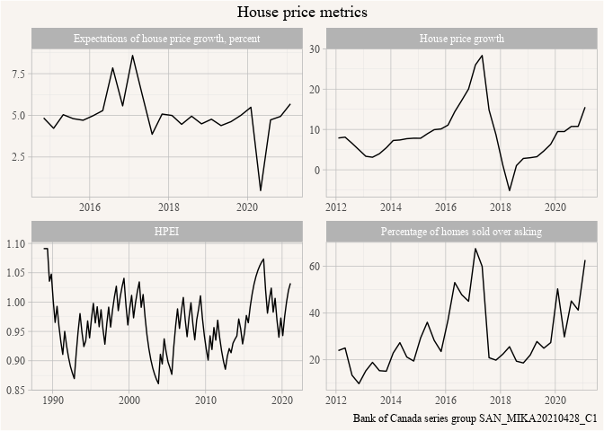

<!-- README.md is generated from README.Rmd. Please edit that file -->

# canboc

<!-- badges: start -->

[](https://github.com/mountainMath/canboc/actions)
<!-- badges: end -->

<a href="https://mountainmath.github.io/canboc/index.html"></a>

An R package to provide convenient access to the Bank of Canada data
API.

# Documentation

[canboc R package home page and reference
guide](https://mountainmath.github.io/canboc/index.html)

## Installation

You can install the released version of canboc from
[CRAN](https://CRAN.R-project.org) with:

``` r
remotes::install_github("mountainmath/canboc")
```

## Example

The package can import data for one or several Bank of Canada time
series or series groups. For example, to access the series group
“SAN\_MIKA20210428\_C1” with metrics pertaining to house price growth in
Canada we can easily retrieve the data using the `get_boc_series_group`
method.

``` r
library(canboc)
library(dplyr)
#> 
#> Attaching package: 'dplyr'
#> The following objects are masked from 'package:stats':
#> 
#>     filter, lag
#> The following objects are masked from 'package:base':
#> 
#>     intersect, setdiff, setequal, union
library(ggplot2)
## basic example code

data <- get_boc_series_group("SAN_MIKA20210428_C1") %>%
  mutate(name=gsub(" \\(.+$","",label)) %>%
  filter(!is.na(value))
#> Downloading BOC series data for SAN_MIKA20210428_C1

ggplot(data,aes(x=date,y=value)) +
  geom_line() +
  facet_wrap(~name, scales="free") +
  labs(title="House price metrics",
       y=NULL,x=NULL,
       caption="Bank of Canada series group SAN_MIKA20210428_C1")
```


